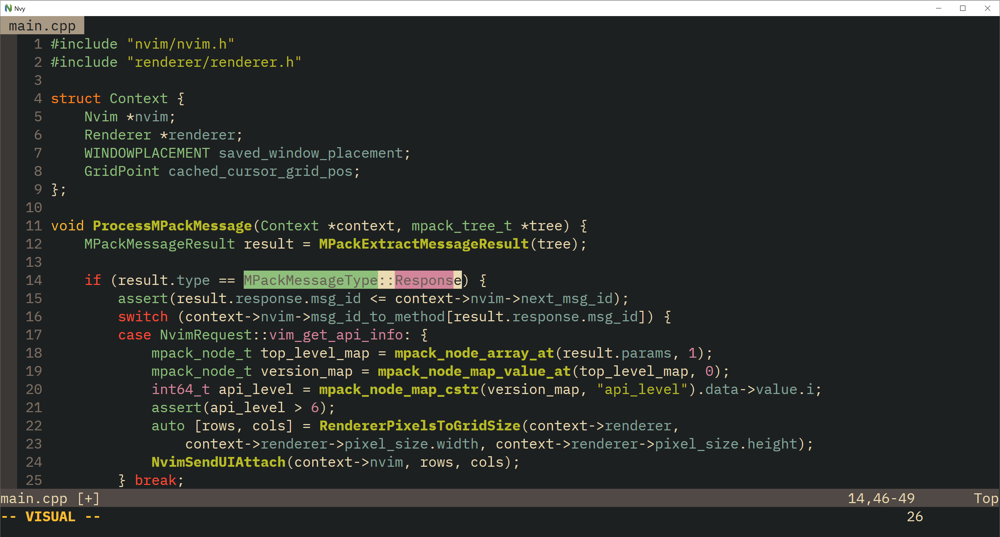

# Nvy
Nvy is a minimal [Neovim](https://neovim.io/) client for Windows written in C++.
It uses DirectWrite to shape and render the grid cells and text.\
As Nvy is just a front-end for Neovim, installing Neovim is required to use Nvy, preferably the
latest nightly version, from [here](https://github.com/neovim/neovim/releases).

# Configuration
Nvy sets the global vim variable `g:nvy = 1` in case you want to specialize your init.vim while using Nvy.

Fonts can be changed by setting the guifont in `init.vim`, for example:
`set guifont=Fira\ Code:h24`.  
Note: you have to specify the font size, e.g. `set guifont=Fira\ Code` won't work.

Nvy can be started with the following flags:
- `--maximize` to start in fullscreen
- `--geometry=<cols>x<rows>` to start with a given number of rows and columns, e.g. `--geometry=80x25`

# Extra Features
- You can use Alt+Enter to toggle fullscreen
- You can use Ctrl+Mousewheel to zoom

# Releases
Releases can be found [here](https://github.com/RMichelsen/Nvy/releases)

# Build
## Requirements
- A compiler supporting `C++20`
- [The latest Windows SDK](https://developer.microsoft.com/en-us/windows/downloads/windows-10-sdk/)

Apart from the Windows SDK, the only dependency Nvy uses is the excellent [MPack](https://github.com/ludocode/mpack) library
which is compiled alongside the client itself.

## Build example with [Ninja](https://ninja-build.org/)
`git clone https://github.com/RMichelsen/Nvy.git`\
`cd Nvy`\
`mkdir build`\
`cd build`\
`cmake .. -GNinja`\
`ninja`
